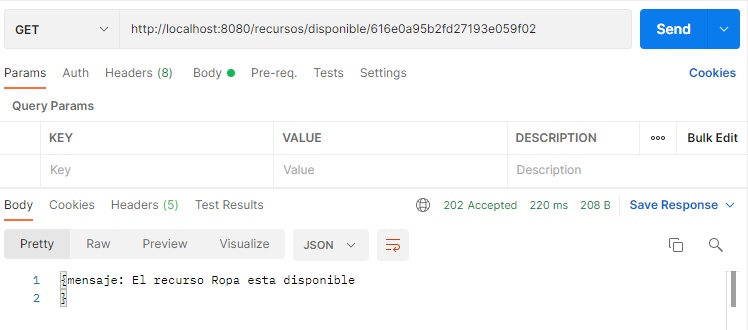

# reactive-biblioteca
Creacion de una api de biblioteca esta es una mejora a nuestra anterior ya que esta utilizara reactividad y las funciones funcionales 
como tambien usara la base de datos mongo
## Tecnologias
- Springboot(java 11 ,maven)
- mongodb (atlas)
- Postman para las comprobaciones
## Consultas
1. Consultar disponibilidad de un recurso indicando en un mensaje si esta disponible o no. en caso de no estar disponible presentar la fecha del préstamo actual del ultimo ejemplar.
- RECURSO DISPONIBLE
  
- RECURSO NO DISPONIBLE
  
2. Prestar un recurso, se debe comprobar si esta prestado o no, indicarlo mediante un mensaje. Si se encuentra disponible debemos marcarlo como prestado y registrar la fecha del préstamo (no es necesario llevar el historia de prestamos).
- PRESTAMO EXITOSO
  
- PRESTAMO NO EXITOSO
  
3. Recomendar un listado de recursos al usuario a partir del tipo de recurso, del área temática o de los dos. Los recursos están clasificados por tipo de recurso (libros, revistas, fichas, etc) pero también por área temática (ciencias, naturaleza, historia, etc).
- RECOMENDAR POR TIPO DE RECURSO
  
- RECOMENTAR POR TEMATICA
  
- RECOMENTAR POR TIPO DE RECURSO Y TEMATICA
  
4. Devolver un recurso que se encontraba prestado, obviamente si un recurso no se encuentra en préstamo no podrá ser devuelto. Indicar el resultado con un mensaje.
- DEVOLUCION EXITOSA
  
- DEVOLUCION FRACASO
  
5. Servicios para hacer CRUD de los recursos.
- GET
   
- POST
  
- PUT
    
- DELETE
    

TRABAJO REALIZADO POR YHOMIRA ALEXANDRA YUPAYCCANA LOPA